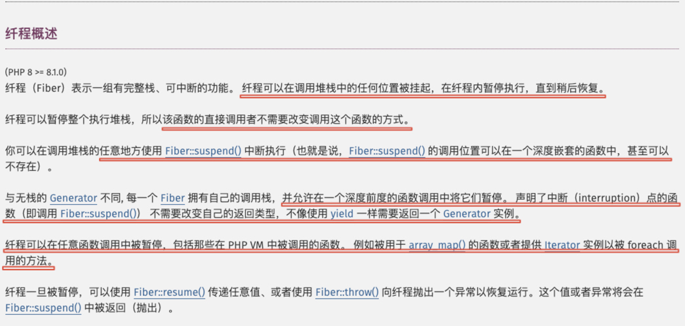

欢迎来到[「我是真的狗杂谈世界」][1]，关注不迷路

# 前言

很早就听说PHP8.1出了[Fiber（又称纤程）](https://www.php.net/manual/zh/language.fibers.php)，但一直也没时间捣鼓它,
正好前段时间在整理PHP的新特性/功能，想看看有没有什么可以给日常开发带来便利、安全、性能提升的，再看到它感觉跟性能有点关系，
于是就决定捣鼓一下，整理记录下捣鼓过程。

---

# 使用

## 基本使用

作为开发者（语言使用用户），肯定先感受一下怎么用。按照官方的demo跑了一下：

```php
$fiber = new Fiber(function (): void {
    echo "我是第二个输出\n";
    Fiber::suspend();
    echo "我是第四个输出\n";
});
echo "我是第一个输出\n";
$fiber->start();
echo "我是第三个输出\n";
$fiber->resume();
echo "我是第五个输出\n";
```

```shell
我是第一个输出
我是第二个输出
我是第三个输出
我是第四个输出
我是第五个输出
```

---

看输出顺序不出所料，看demo的意思应该还可以双向传递数据：

```php
$fiber = new Fiber(function (string $fruit1, string $fruit2): void {
    echo "我是第二个输出；混合水果为：{$fruit1}, {$fruit2}\n";
    $amount = Fiber::suspend("{$fruit1}{$fruit2}汁");
    echo "我是第四个输出；收银为：{$amount}\n";
    Fiber::suspend($amount - 23.5);
});
echo "我是第一个输出\n";
$juice = $fiber->start("苹果", "西瓜");
echo "我是第三个输出；果汁为：{$juice}\n";
$change = $fiber->resume(50);
echo "我是第五个输出；找零为：{$change}\n";
```

```shell
我是第一个输出
我是第二个输出；混合水果为：苹果, 西瓜
我是第三个输出；果汁为：苹果西瓜汁
我是第四个输出；收银为：50
我是第五个输出；找零为：26.5
```

## 对比生成器

好家伙，看起来是挺新鲜的，但是不是立马想到了PHP5中就支持的生成器+yield（具体生成器+yield的使用说明参考[「Chapter 3.PHP5 生成器与yield及原理浅析」][1]
）呢？
于是带着疑问阅读了一下官方文档，果然有写两者的区别：



可以在无需改造中间函数模拟构建调用堆栈的前提下，在任意位置进行Fiber控制，而这在之前的生成器+yield的实现下是无法做到的

这也是之前PHP界一些协程框架一直被诟病之处，必须通过层层嵌套来模拟（模拟方式参考[「Chapter 3.PHP5 生成器与yield及原理浅析」][1]

---

尝试一下（Fiber匿函中调用otherFunc时无需像yield那样就行改造，就像正常函数调用一样就可以）：

```php
$fiber = new Fiber(function (): void {
    otherFunc();
});
echo "我要开始咯\n";
$juice = $fiber->start();
echo "另一个函数成功暂停了Fiber；现在尝试恢复Fiber\n";
$fiber->resume();

function otherFunc(): void
{
    echo "Fiber已经进入了另一个函数；现在在这里尝试暂停该Fiber\n";
    Fiber::suspend();
    echo "Fiber已经恢复，我也结束自己的生命周期了\n";
}
```

```shell
我要开始咯
Fiber已经进入了另一个函数；现在在这里尝试暂停该Fiber
另一个函数成功暂停了Fiber；现在尝试恢复Fiber
Fiber已经恢复，我也结束自己的生命周期了
```

## 为什么？

知道了可以这样用，总是想要再进一步了解下为什么Fiber可以这么用，而生成器+yield却不行呢？

带着这个问题开始下一个环节：

---

# 深入一点

继续在官方文档中寻找蛛丝马迹，发现其实在同一段话中已经把原因也说清楚了～～


原因就是：

- 生成器则无栈
- Fiber具备独立执行堆栈（执行堆栈相关知识参考[「Chapter 4. 程序执行过程中的执行堆栈」][1]）

## 生成器执行过程

生成器的执行过程参考[「Chapter 3.PHP5 生成器与yield及原理浅析」][1]

## Fiber执行过程

基于Fiber具备独立执行堆栈的前提，不妨以下方代码为例猜想一下Fiber大致执行过程（先不管双向值传递）：

```php
$fiber = new Fiber(function (): void {
    otherFunc();
});
echo "我要开始咯\n";
$juice = $fiber->start();
echo "另一个函数成功暂停了Fiber；现在尝试恢复Fiber\n";
$fiber->resume();

function otherFunc(): void
{
    echo "Fiber已经进入了另一个函数；现在在这里尝试暂停该Fiber\n";
    Fiber::suspend();
    echo "Fiber已经恢复，我也结束自己的生命周期了\n";
}
```

---

### 上下文信息初始化

- 分配一块空间用于维护主执行堆栈和全部Fiber执行堆栈上下文信息的集合（图中的101～200区块）


图中（下图同）内存只展示用户空间几个主要区块，并且为了更简单展示Fiber的执行过程，内存、CPU一级ZendVM屏蔽和抽象了一些细节，如需更多了解细节，可参考以下文章：

- [「Chapter 4. 程序执行过程中的执行堆栈」][1]
- [「Chapter 5. 从CPU和内存视角看程序运行」][1]

---

### Fiber的初始化

```php
$fiber = new Fiber(function (): void {
    otherFunc();
});
```

当CPU以主线程栈区为执行堆栈执行到002行时：

- 在用户空间分配一块内存（一般从堆中）充当该Fiber的执行堆栈（图中9900～9801区块）
- 将该Fiber状态以及其执行堆栈上下文信息加入上下文维护集合（图中106～110，可以认为Fiber包的指令起始位置为003行，因此EIP为003；匿函没有参数和局部变量，因此ESP和EBP都指向9900）


---

### Fiber的启动

```php
$juice = $fiber->start();
```

CPU继续以主线程栈区为执行堆栈执行了005行，执行到006行时：

- 暂存当前CPU上下文至维护集合中主执行堆栈上下文信息中（图中101～105，当前执行指令行为006，因此EIP为007）
- 从维护集合中将目标Fiber标记为激活状态，并将其执行堆栈上下文信息（图中106～110）填充至当前CPU上下文中


---

### Fiber中调用otherFunc函数

CPU以Fiber栈区为执行堆栈执行003行，调用otherFunc函数，函数调用的过程参考[「Chapter 4. 程序执行过程中的执行堆栈」][1]


---

### Fiber的暂停

```php
    Fiber::suspend();
```

CPU以Fiber栈区为执行堆栈执行012行，执行到013行时：

-
暂存当前CPU上下文至维护集合中代表该Fiber的上下文信息中（图中106～110，当前执行指令行为013，因此EIP为014；当前Fiber在otherFunc中且无参数和局部变量，因此ESP和EBP指向otherFunc栈帧，也就是9899）
- 将该Fiber标记为休眠状态
- 从维护集合中将主执行堆栈上下文信息（图中101～105）填充至当前CPU上下文中


---

### Fiber的恢复

```php
$fiber->resume();
```

CPU以主线程栈区为执行堆栈执行007行，执行到008行时（同上述 Fiber的启动过程）：

- 暂存当前CPU上下文至维护集合中主执行堆栈上下文信息中（图中101～105，当前执行指令行为008，因此EIP为009）
- 从维护集合中将目标Fiber标记为激活状态，并将其执行堆栈上下文信息（图中106～110）填充至当前CPU上下文中


---

### Fiber的终结

CPU以Fiber栈区为执行堆栈执行014行，otherFuc函数返回（栈帧出栈），回到004行，Fiber终结时：

- 从维护集合中删除目标Fiber的状态信息及其执行堆栈上下文信息（图中106～110）
- 销毁该Fiber对应的执行堆栈（图中9801～9900）
- 将主线程（启动/唤醒该Fiber的调用者）上下文信息（图中101～105）填充至当前CPU上下文中，使CPU回到主线程栈运行


---

# 源码验证

以上过程只是猜测，为了验证这个猜测的正确性与正确度，带着三脚猫的C记忆来看一下Fiber的源码实现：

---

## 核心代码文件

先找到几个主要文件中的主要代码块（还好PHP源码很容易就能找到这俩文件）:

- [zend_fibers.h](https://github.com/php/php-src/blob/master/Zend/zend_fibers.h)
- [zend_fibers.c](https://github.com/php/php-src/blob/master/Zend/zend_fibers.c)

---

## Fiber核心结构

为Fiber设置了初始化、运行中、暂停、死亡四种状态：

```
typedef enum {
	ZEND_FIBER_STATUS_INIT,
	ZEND_FIBER_STATUS_RUNNING,
	ZEND_FIBER_STATUS_SUSPENDED,
	ZEND_FIBER_STATUS_DEAD,
} zend_fiber_status;
```

---

每个Fiber的上下文结构中维护了该Fiber的函数入口、执行堆栈、状态等信息

```
struct _zend_fiber_context {
	/* Pointer to boost.context or ucontext_t data. */
	void *handle;

	/* Pointer that identifies the fiber type. */
	void *kind;

	/* Entrypoint function of the fiber. */
	zend_fiber_coroutine function;

	/* Cleanup function for fiber. */
	zend_fiber_clean cleanup;

	/* Assigned C stack. */
	zend_fiber_stack *stack;

	/* Fiber status. */
	zend_fiber_status status;

	/* Observer state */
	zend_execute_data *top_observed_frame;

	/* Reserved for extensions */
	void *reserved[ZEND_MAX_RESERVED_RESOURCES];
};
```

---

一个Fiber结构中包含了自身、调用者、恢复目标的上下文，执行堆栈当前栈底帧。看起来不是独立一块空间维护全部上下文，而是自维护并组成链表

```
/*  */
struct _zend_fiber {
	/* PHP object handle. */
	zend_object std;

	/* Flags are defined in enum zend_fiber_flag. */
	uint8_t flags;

	/* Native C fiber context. */
	zend_fiber_context context;

	/* Fiber that resumed us. */
	zend_fiber_context *caller;

	/* Fiber that suspended us. */
	zend_fiber_context *previous;

	/* Callback and info / cache to be used when fiber is started. */
	zend_fcall_info fci;
	zend_fcall_info_cache fci_cache;

	/* Current Zend VM execute data being run by the fiber. */
	zend_execute_data *execute_data;

	/* Frame on the bottom of the fiber vm stack. */
	zend_execute_data *stack_bottom;

	/* Active fiber vm stack. */
	zend_vm_stack vm_stack;

	/* Storage for fiber return value. */
	zval result;
};
```

## Fiber核心功能

为了方便阅读，源码中仅留下重要代码，前后用/* ... */代替了：

- `Fiber::start`、`Fiber::resume`方法内部指向`zend_fiber_resume`函数
- `Fiber::suspend`方法内部指向`zend_fiber_suspend`函数

```
ZEND_METHOD(Fiber, start)
{
	/* ... */

	fiber->previous = &fiber->context;

	zend_fiber_transfer transfer = zend_fiber_resume(fiber, NULL, false);

    /* ... */
}
ZEND_METHOD(Fiber, suspend)
{
	/* ... */

	zend_fiber_transfer transfer = zend_fiber_suspend(fiber, value);

	/* ... */
}
ZEND_METHOD(Fiber, resume)
{
	/* ... */

	zend_fiber_transfer transfer = zend_fiber_resume(fiber, value, false);

	/* ... */
}
```

---

- `zend_fiber_resume`、`zend_fiber_suspend`函数内部指向`zend_fiber_switch_to`函数（顾名思义进行fiber切换）

```
static zend_always_inline zend_fiber_transfer zend_fiber_resume(zend_fiber *fiber, zval *value, bool exception)
{
	/* ... */

	/* 恢复对方=切换上下文至对方的previous（start时该值为对方自身，之后可在暂停和传递时被替换） */
	zend_fiber_transfer transfer = zend_fiber_switch_to(fiber->previous, value, exception);

	/* ... */
}
static zend_always_inline zend_fiber_transfer zend_fiber_suspend(zend_fiber *fiber, zval *value)
{
	/* ... */

	/* 暂停自己=切换上下文至调用自己的那个 */
	return zend_fiber_switch_to(caller, value, false);
}
```

---

- `zend_fiber_switch_to`函数内部指向`zend_fiber_switch_context`
  函数（顾名思义切上下文），结合上面定义的Fiber上下文结构，最终切换的就是CPU上的寄存器内容了，就到这儿吧（再深入怕胡说八道露了馅）

```
static zend_always_inline zend_fiber_transfer zend_fiber_switch_to(
	zend_fiber_context *context, zval *value, bool exception
) {
	/* ... */

	zend_fiber_switch_context(&transfer);

	/* ... */
}
```

---

- 还有一个初始化分配Fiber所需空间的函数

```
static zend_object *zend_fiber_object_create(zend_class_entry *ce)
{
	/* 分配对象空间 */
	zend_fiber *fiber = emalloc(sizeof(zend_fiber));
	memset(fiber, 0, sizeof(zend_fiber));

	/* ... */
}
```

## 阅读小结

到了这里，可以知道猜测跟实现略有出入，但基本差不多。

# 总结与扩展

1. 这样看起来，Fiber（纤程）其实就是一种有栈协程（用户态线程）的实现，因此它具备全部协程的特点；
2. Fiber本身是一种N:1的线程模型，也许可以结合多线程扩展来实现类似Golang的N:M模型（pthread被放弃了，还未尝试，不过也需要结合第5点）；
3. Fiber将全部的切换过程完全交由用户（开发者）控制，没有像Golang在runtime或者说引擎/VM中做任何掌控/协助调度的功能；
4. Fiber本身并没有解决IO阻塞问题，如果直接用它不会提升效率，反而会带来额外的性能开销和阅读成本；
5.
如果想要有所发挥，感觉需要在Cli运行模式下封装非阻塞IO和fiber调度器（react和amp基本都是这思路，只是基于生成器+yield方案），同时用第2点的方式构建N:
M模型来避免阻塞调用的影响，但这样基本都构成一套简易Golang的调度runtime（参考[「Chapter 9. Go goroutine与其调度过程」][1]）；
6. 而在FPM运行模式下，感觉有点没什么用武之地，更像是一个底层的玩具API（或许官方在8.1加入Fiber只是第一步，未来可能会从各方面动作来配合实现性能和并发的提升，但势必也意味着复杂和变化吧～）。

---

最后贴一个[Fiber和Swoole的瓜](https://www.zhihu.com/question/448805077)，许久没关注，错过了刀光剑影～

[1]: https://github.com/huguoqiang0520/mass/blob/main/README.md