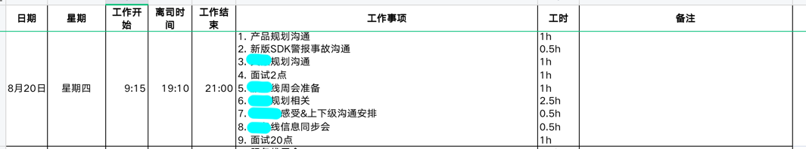
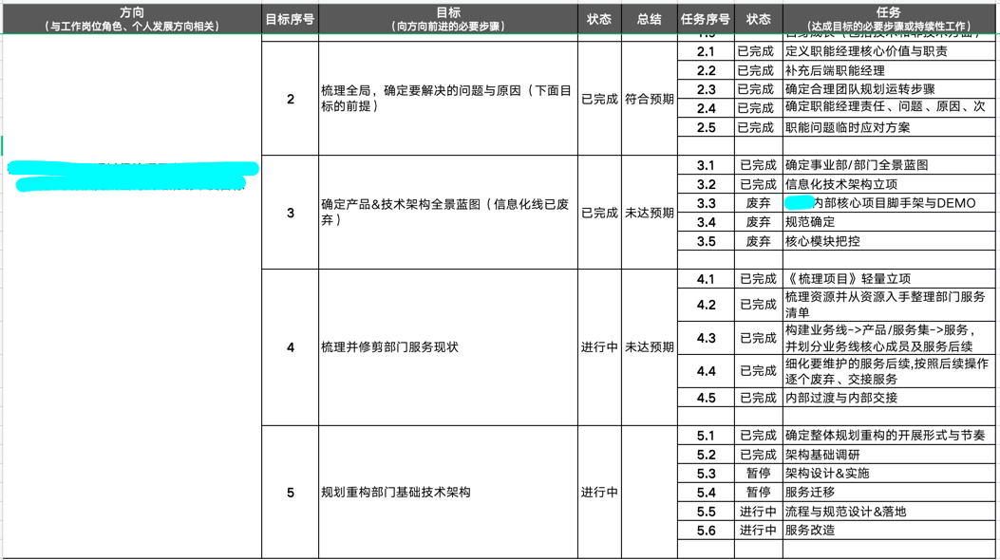
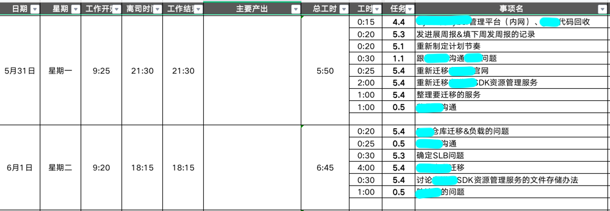
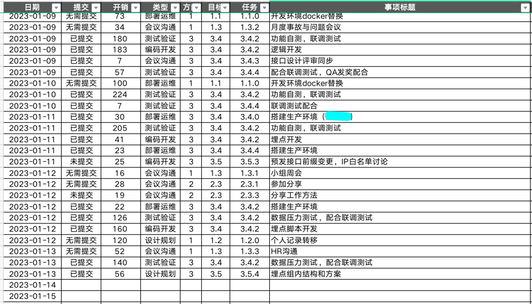

# 前言

事先声明，这不是一片技术分享！！！只是回想起那些写总结痛苦的日子，于是就想记录一下这段历史。

---

2022年已经过去了，前几天的你是否在忙着写年终总结呢？不知道你是否遇到挠破头皮不知如何下笔的情况？（咳咳这是我前些年的状态）

这次花费了4个小时写完，大部分时间是在布局、措辞和格式调整上（具体总结就不贴图了，可以贴下数据统计）：

# 背景

这还得回到2020年说起：

这年，已经是我的职业生涯的第五个年头了，也是我在一家公司的第五个年头了（你可能很惊讶居然有人可以在互联网企业待五年，是不是躺了？）

由于当时工作的环境，我面临着一些问题：

- 精力分散不聚焦：充当多个系统的产品、开发、测试、运维、客服角色，每天面对各种咨询和维护，估计能占70%以上了；
- 产出凌乱难说明：最讨厌各种周报、月报、总结，因为我根本不知道自己做了什么，做的这些又产生了什么效果；
- 成长停滞缺方向：感觉自己想要成长，可以不知道该向什么方向走，也没有精力。

# 转机

当然也不是没有向上反馈、向朋友咨询过，但奈何身边都是技术，大家只能大眼瞪小眼，抱怨牢骚几句；

直到20年跟一个战略分析的朋友聊起这些，我得到了一些建议和启发：

> 这里只简单介绍书籍和工具跟本文有关的部分内容与功能。

### 《卓有成效的管理者》

这是一本耳熟能详的书，我以前对这类书是嗤之以鼻的，但这次我决定好好看看，还是有不少感触的：

- 管理不是放到一个岗位上，下面有多少人，自己就有很多需要管理的事；
- 卓有成效是可以学会的，而不是一种天赋；
- 掌握自己的时间很重要：记录、管理、安排。

### 《高效能人士的7个习惯》

其实这本书不是第一遍阅读了，刚毕业入职公司就推荐的这本书，但同样的毛病，那时追求技术的我对这类书总是有一种瞧不上，读了也跟没读一样。
但经历了社会毒打的我二翻的时候还是很不一样的：

- 以终为始：自我领导的原则；
- 要事第一：自我管理的原则。

### 滴答清单

这是一个规划安排和提醒事务的工具：

- 任务提醒：提供一次性的、重复周期性的任务提醒；
- 番茄专注：提供番茄工作法计时，同时记录了专注数据；
- 习惯打卡：各类习惯打卡提醒，同时记录了打卡数据。

# 2020-实践

于是我向这位朋友要来了TA的个人工作记录模板，开始有样学样尝试记录。

- 每天开始工作时花费几分钟计划一下自己一天的安排，工作中不断记录自己的任务时间占用，结束工作时则花几分钟整理补充一下；
- 滴答里面设置了每天开始计划和结束整理两个提醒，如果遇到一个需要在某个时间处理的任务/事项，也会往滴答里面追加。

> 刚开始特别不习惯，所以需要一段时间强迫自己坚持。

## 20年的样子

# 2021-升级

当我开始习惯于这样规划安排记录自己的工作，我大致能看到自己的工作精力分配，通过这些数据我发现我经常处理各种零碎、临时的事情。

---

于是我开始思考一个问题，理想状态下我希望我是如何进行工作的？

这时候我想到了当时公司在推广的OKR（虽然个人觉得公司推广地很不落地）， OKR的制定过程是自上而下拆解与自下而上汇总结合，同时可以上下左右对齐。
那类推映射到我承担一个岗位：

- 从岗位职责到年度目标再到每月每周的任务再到每天的工作事项；
- 自上而下可拆解，自下而上可汇总，上下左右可对齐的；
- 当然会有少量不再其中的事务，但比例不应当过高。

## 21年的样子

21年我开始不只是简单记录，而是思考规划和拆解自己的工作，一直落地到每天的事项：

# 2022-升级

这年我换了工作环境，基本还是21年的方法论和模板，做了一些升级：

- 番茄专注：开始借助滴答自带的番茄专注来提醒自己，同时协助记录专注数据；
- 总结升级：每日总结加入一些事件记录、情绪记录；每个月也会基于日总结进行月度总结；
- 习惯打卡：开始将工作学习生活中希望自己养成习惯放入滴答习惯打卡提醒和处理（比如喝水这个还是很有必要的）。

## 22年的样子

- excel部分基本与21年保持一致；
- 滴答清单填充了更多更细节的数据，也就是本文开头贴的图。

# 2023-升级

前几天刚刚进行了升级：

- 迁移sqlite：本来想说程序员怎么可以不用数据库呢，但是迁移过去之后可视化界面实在难用，又开始跪舔万能的excel了；
- 重构规划：将学习按照专业划分、工作按照岗位划分作为一级方向，重新制定了方向->目标->任务->事项的规划；
- 类型维度：每个事项增加了类型维度，细分记录统计在设计、开发、测试、沟通等类型上的精力开销；
- 提交维度：每个事项增加了提交维度，记录是否与三方平台（比如公司工单系统）提交同步过。

## 23年的样子

基本与22年保持一致，excel细化维护了事项类型和提交状态：

# 写在最后

- 一个99分的方法不如60分的方法+坚持，我还会不断升级这套方法；
- 每个人都有适合自己的习惯和方法，只是分享一下，并非觉得一定哪种更好；
- 我用这套方法是为了帮助我更有效开展计划达成目的，而非有效地卷，该玩的时候就玩，也不会把玩的时间记录上去。
